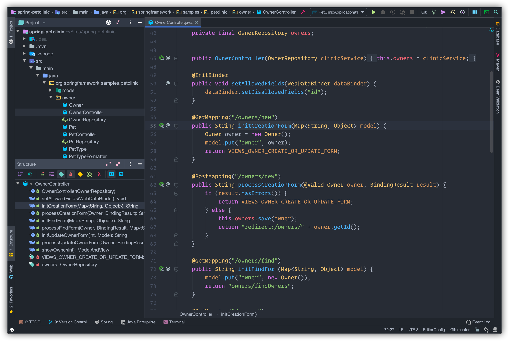
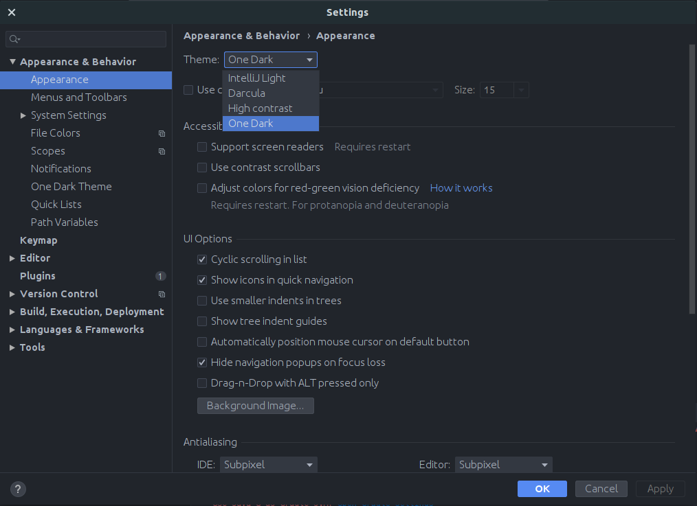
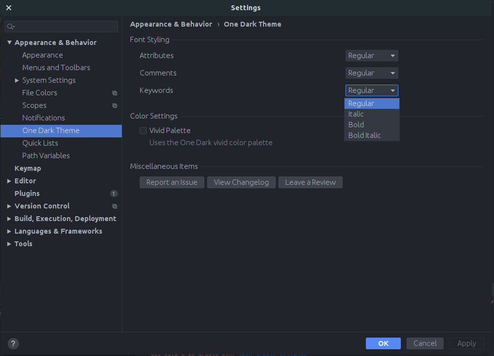

# JetBrains One Dark Theme

> [One Dark](https://github.com/atom/one-dark-syntax) theme for JetBrains.

## Sponsors

Request and perform code reviews from inside your IDE. Review any code, even if it's a work-in-progress that hasn't been committed yet, and use jump-to-definition, your favorite keybindings, and other IDE tools. 
[Try it free](https://sponsorlink.codestream.com/?utm_source=jbmarket&utm_campaign=jbonedarktheme&utm_medium=banner)

## Setup

After installing the theme, go to `Preferences | Appearance & Behavior | Appearance` and select the new `One Dark` theme in the theme dropdown. 
Once you have selected `One Dark` in the theme options, click the **OK** button to apply the changes, so you can start enjoying One Dark theme!

## Configuration

After setting up the theme, you can configure the appearance of the syntax highlighting of the theme.

Go to `Preferences | Appearance & Behavior | One Dark Theme` where you have various appearance settings to configure at your disposal.

### Font Styling

This section affects the styling of your font in the code editor. 
Each option represents a collection of [PSI elements](https://www.jetbrains.org/intellij/sdk/docs/basics/architectural_overview/psi.html).
Which can have `Regular | Italic | Bold | Bold Italic` styling applied to them.

- **Attributes**: These include various supporting elements such as (but not limited to):
    - Annotations, HTML Attributes, URLS, etc.
- **Comments**: This includes things such as: Block Comments, Inline Comments, and other forms of comments.
- **Keywords**: These are all the representations of reserved words in your current language.

### Color Settings

- **Vivid Palette**: This applies the [vivid syntax color palette](https://atom.io/themes/one-dark-vivid-syntax) inplace of the default color palette.

## Further Documentation

Check out the [docs](https://one-dark.gitbook.io/jetbrains) for manual installation instructions, additional screenshots, and contributing guidelines.

- [Installation](https://one-dark.gitbook.io/jetbrains/the-basics/installation)
- [Screenshots](https://one-dark.gitbook.io/jetbrains/the-basics/screenshots)
- [Contributing](https://one-dark.gitbook.io/jetbrains/contributing/development)

## Thanks

- Thanks to [Egor Yurtaev](https://github.com/yurtaev) who created the repository this project was based on. Without that starting point, this plugin may have never been created.
- Thanks to GitBook for hosting the docs!
- Finally, thanks to everyone who has contributed to this project through issues, pull requests, and plugin usage. Your usage and feedback has helped to make this plugin what it is!

## Contributors ✨

Thanks goes to these wonderful people ([emoji key](https://allcontributors.org/docs/en/emoji-key)):

<!-- ALL-CONTRIBUTORS-LIST:START - Do not remove or modify this section -->
<!-- prettier-ignore-start -->
<!-- markdownlint-disable -->
<table>
  <tr>
    <td align="center"><a href="https://github.com/mskelton"> <b>Mark Skelton</b></a> <a href="https://github.com/one-dark/jetbrains-one-dark-theme/commits?author=mskelton" title="Code">💻</a> <a href="#question-mskelton" title="Answering Questions">💬</a> <a href="https://github.com/one-dark/jetbrains-one-dark-theme/commits?author=mskelton" title="Documentation">📖</a> <a href="#ideas-mskelton" title="Ideas, Planning, & Feedback">🤔</a> <a href="#maintenance-mskelton" title="Maintenance">🚧</a></td>
    <td align="center"><a href="https://www.dacoto.com"> <b>David Cortés</b></a> <a href="https://github.com/one-dark/jetbrains-one-dark-theme/issues?q=author%3Adacoto" title="Bug reports">🐛</a></td>
    <td align="center"><a href="http://x1unix.com"> <b>Denis Sedchenko</b></a> <a href="https://github.com/one-dark/jetbrains-one-dark-theme/issues?q=author%3Ax1unix" title="Bug reports">🐛</a></td>
    <td align="center"><a href="https://github.com/zakh508"> <b>zakh508</b></a> <a href="https://github.com/one-dark/jetbrains-one-dark-theme/issues?q=author%3Azakh508" title="Bug reports">🐛</a></td>
    <td align="center"><a href="https://github.com/GauthierPLM"> <b>Gauthier Pogam--Le Montagner</b></a> <a href="#ideas-GauthierPLM" title="Ideas, Planning, & Feedback">🤔</a></td>
    <td align="center"><a href="https://github.com/eickit"> <b>eickit</b></a> <a href="#design-eickit" title="Design">🎨</a></td>
    <td align="center"><a href="https://github.com/cnfn"> <b>Cnfn</b></a> <a href="#design-cnfn" title="Design">🎨</a></td>
  </tr>
  <tr>
    <td align="center"><a href="https://github.com/cliffordp"> <b>Clifford</b></a> <a href="https://github.com/one-dark/jetbrains-one-dark-theme/issues?q=author%3Acliffordp" title="Bug reports">🐛</a></td>
    <td align="center"><a href="https://defman.me"> <b>Sergey Kislyakov</b></a> <a href="https://github.com/one-dark/jetbrains-one-dark-theme/issues?q=author%3Adefman21" title="Bug reports">🐛</a></td>
    <td align="center"><a href="https://github.com/sundongmin"> <b>Sun Dongmin</b></a> <a href="#design-sundongmin" title="Design">🎨</a></td>
    <td align="center"><a href="https://github.com/levani"> <b>Levani Melikishvili</b></a> <a href="#design-levani" title="Design">🎨</a></td>
    <td align="center"><a href="https://blog.csdn.net/qq_21019419"> <b>lynn</b></a> <a href="#design-tulongxCodes" title="Design">🎨</a></td>
    <td align="center"><a href="https://unthrottled.io"> <b>Alex Simons</b></a> <a href="https://github.com/one-dark/jetbrains-one-dark-theme/commits?author=Unthrottled" title="Code">💻</a> <a href="#question-Unthrottled" title="Answering Questions">💬</a></td>
    <td align="center"><a href="https://github.com/XanderCheung"> <b>XanderCheung</b></a> <a href="https://github.com/one-dark/jetbrains-one-dark-theme/issues?q=author%3AXanderCheung" title="Bug reports">🐛</a></td>
  </tr>
  <tr>
    <td align="center"><a href="https://github.com/maxmalov"> <b>Maxim Malov</b></a> <a href="#design-maxmalov" title="Design">🎨</a></td>
  </tr>
</table>

<!-- markdownlint-enable -->
<!-- prettier-ignore-end -->

<!-- ALL-CONTRIBUTORS-LIST:END -->

This project follows the [all-contributors](https://github.com/all-contributors/all-contributors) specification. Contributions of any kind welcome!
