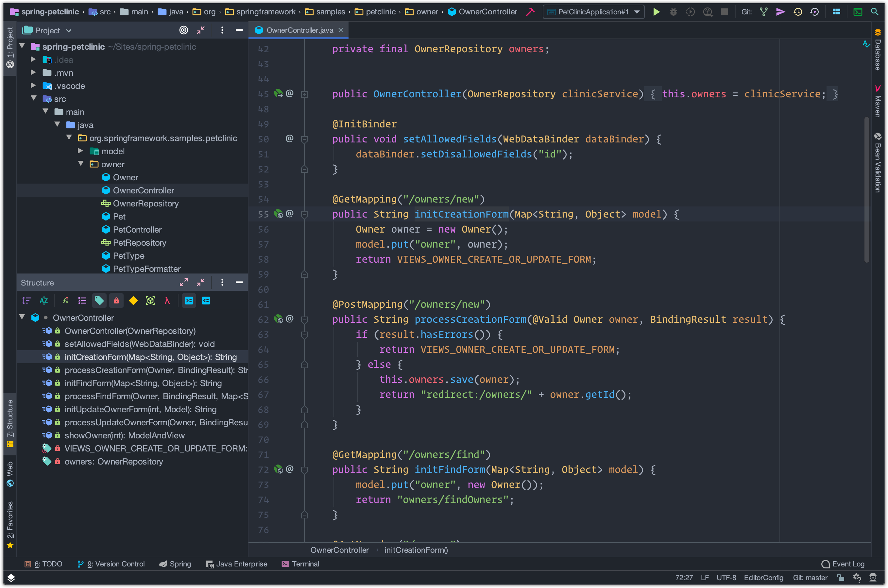
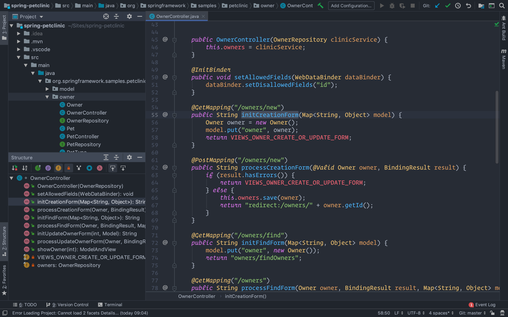

# JetBrains One dark theme

[![Build status][1]][2]
[![GitHub tag][3]][4]
[![JetBrains plugin version][5]][6]
[![JetBrains plugin downloads][7]][6]

[One dark](https://github.com/atom/one-dark-syntax) theme for JetBrains IDEs. Includes normal and italic variations.

Check out the [Wiki][9] for more information and instructions or use one of the quick links below.

- [Installation][10]
- [Configuration][11]
- [Development][12]

## Screenshots

See the [Wiki page][13] for more screenshots.

### Normal theme

### Italic theme

[1]: https://img.shields.io/travis/com/markypython/jetbrains-one-dark-theme/master.svg
[2]: https://travis-ci.com/markypython/jetbrains-one-dark-theme "Build status"
[3]: https://img.shields.io/github/tag/markypython/jetbrains-one-dark-theme.svg
[4]: https://github.com/markypython/jetbrains-one-dark-theme/releases/latest "Latest release"
[5]: https://img.shields.io/jetbrains/plugin/v/11938-one-dark-theme.svg
[6]: https://plugins.jetbrains.com/plugin/11938-one-dark-theme "Plugin homepage"
[7]: https://img.shields.io/jetbrains/plugin/d/11938-one-dark-theme.svg
[9]: https://github.com/markypython/jetbrains-one-dark-theme/wiki "Wiki home"
[10]: https://github.com/markypython/jetbrains-one-dark-theme/wiki/Installation "Installation instructions"
[11]: https://github.com/markypython/jetbrains-one-dark-theme/wiki/Configuration "Configuration instructions"
[12]: https://github.com/markypython/jetbrains-one-dark-theme/wiki/Development "Development instructions"
[13]: https://github.com/markypython/jetbrains-one-dark-theme/wiki/Screenshots "Screenshots"

## Contributors

Thanks goes to these wonderful people ([emoji key](https://allcontributors.org/docs/en/emoji-key)):

<!-- ALL-CONTRIBUTORS-LIST:START - Do not remove or modify this section -->
<!-- prettier-ignore -->
<table><tr><td align="center"><a href="https://github.com/markypython"> <b>Mark Skelton</b></a> <a href="https://github.com/markypython/jetbrains-one-dark-theme/commits?author=markypython" title="Code">💻</a> <a href="#question-markypython" title="Answering Questions">💬</a> <a href="https://github.com/markypython/jetbrains-one-dark-theme/commits?author=markypython" title="Documentation">📖</a> <a href="#ideas-markypython" title="Ideas, Planning, & Feedback">🤔</a> <a href="#maintenance-markypython" title="Maintenance">🚧</a></td></tr></table>

<!-- ALL-CONTRIBUTORS-LIST:END -->

This project follows the [all-contributors](https://github.com/all-contributors/all-contributors) specification. Contributions of any kind welcome!