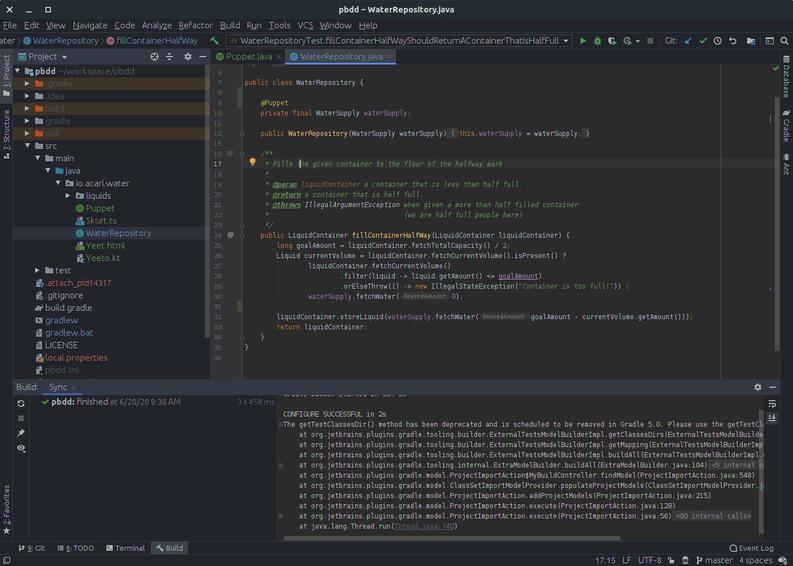
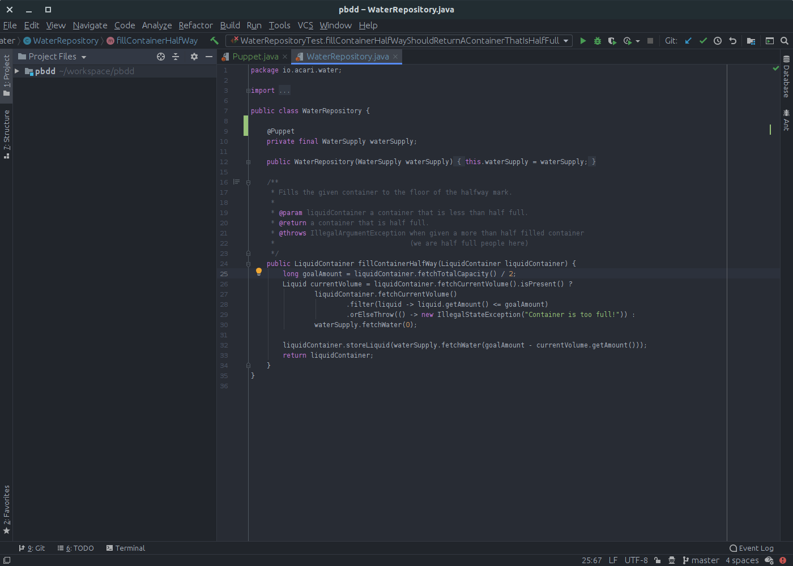

# Frequently Asked Questions

Programming is hard, and building things that work perfectly all the time is even harder.
We have collected various issues that we, plugin developers, can solve automatically for you.  

## My editor colors are not showing up!

I just updated `One Dark` and now my IDE looks like this:

**Fix:**

1. Restart your IDE
1. [Re-Apply the theme](https://github.com/one-dark/jetbrains-one-dark-theme#setup).

## My editor does not look as pretty!

I installed the theme, however my editor is not as vibrant as it is in the screenshots.

**Fix:**

There is no one size fits all solution for this.

The issue is that your IDE does not currently recognize the file as a project file.
When the IDE knows that this file is a part of the project itself, it can break the file into [PSI Elements](https://www.jetbrains.org/intellij/sdk/docs/basics/architectural_overview/psi.html).
Once it does that, then the theme can apply all the vibrant colors to the file.

- **Java**: [Here is one known solution](https://github.com/one-dark/jetbrains-one-dark-theme/issues/129#issuecomment-606815810)
- **C++**: [Here is one known solution](https://github.com/one-dark/jetbrains-one-dark-theme/issues/127#issuecomment-597393696)

